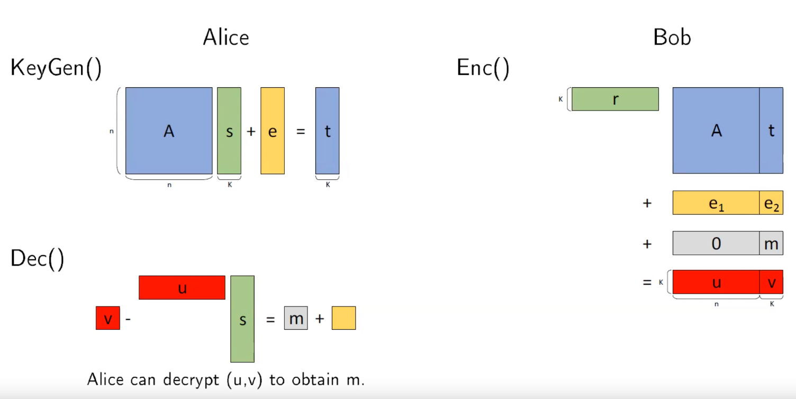

## CRYSTALS - Kyber
Kyber is a post quantum key encapsulation algorithm. 

# Parameter sets for Kyber [1]
pk: public key
sk: secret key
ct: cipher text

| Algorithm  | NIST Security Level | Parameters |      |      | Size (in Bytes) |      |      |
|------------|---------------------|------------|------|------|-----------------|------|------|
|            |                     | n          | k    | q    | sk              | pk   | ct   |
| Kyber512   | 1                   | 256        | 2    | 3,329| 1,632           | 800  | 768  |
| Kyber768   | 3                   | 256        | 3    | 3,329| 2,400           | 1,184| 1,088|
| Kyber1024  | 5                   | 256        | 4    | 3,329| 3,168           | 1,568| 1,568|

### LWE (Learning With Errors)

```


```

sources
-------
Mojtaba Bisheh-Niasar,  
CEECS Department, Florida Atlantic University,  
mail: mbishehniasa2019@fau.edu  
lecture: https://www.youtube.com/watch?v=zsEj28SFyCs


Another