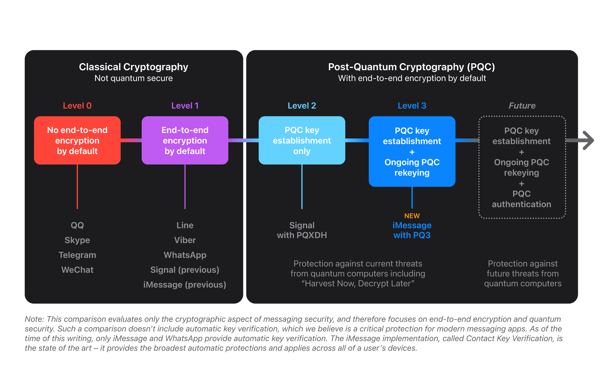

### NIST (National Institute of Standards and Technology) Papers
As of August 13, 2024 the Secretary of Commerce approved three Federal Information Processing Standards ([FIPS](https://csrc.nist.gov/projects/post-quantum-cryptography)) for post-quantum cryptography:
1. Module-Lattice-Based Key-Encapsulation Mechanism Standard
    - https://doi.org/10.6028/NIST.FIPS.203 
2. Module-Lattice-Based Digital Signature Standard
    - https://doi.org/10.6028/NIST.FIPS.204
3. Stateless Hash-Based Digital Signature Standard
    - https://doi.org/10.6028/NIST.FIPS.205

### Lattice based problems
The private key pair is closed to perpendicular, likes the unit vectors defining a space in linear algebra. 

The public key vectors are almost parallel requiring many vectors added together to come close to the solution of either:
- the shortest vector problem  
- or the closest vector problem 

Links: [video0](https://www.youtube.com/watch?v=_C5dkUiiQnw), [video1](https://www.youtube.com/watch?v=QDdOoYdb748), [video2](https://www.youtube.com/watch?v=K026C5YaB3A)

These are hard problems that can, however be solved. To make them secure we have to incorporate solving with errors.  
A,t: Public key  
s: Secret key  
e: Error  
u:
v:
r:

### Contemporary quantum resistant algorithms
Real life examples of quantum resistant algorithms include:
- Signal using **PQXDH** (Post-Quantum Extended Diffie-Hellman) NIST 203
    - https://signal.org/docs/specifications/pqxdh/
- iMessage using **PQ3** (Post-Quantum 3)
    - https://security.apple.com/blog/imessage-pq3/

### Module-Lattice-Based Key-Encapsulation Mechanism Standard
Here is an overview of the basic key encapsulation mechanism.

KeyGen
- 

### Module-Lattice-Based Digital Signature Standard

### Stateless Hash-Based Digital Signature Standard 

