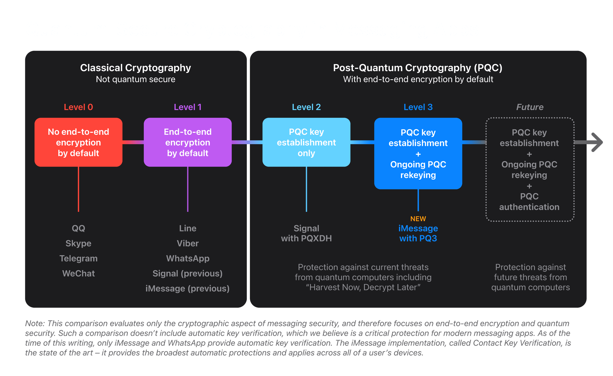
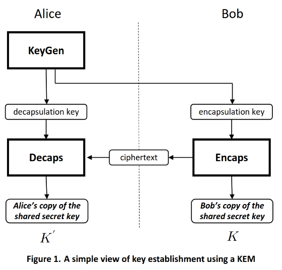

### NIST (National Institute of Standards and Technology) Papers
As of August 13, 2024 the Secretary of Commerce approved three Federal Information Processing Standards ([FIPS](https://csrc.nist.gov/projects/post-quantum-cryptography)) for post-quantum cryptography:
1. Module-Lattice-Based Key-Encapsulation Mechanism Standard
    - https://doi.org/10.6028/NIST.FIPS.203 
2. Module-Lattice-Based Digital Signature Standard
    - https://doi.org/10.6028/NIST.FIPS.204
3. Stateless Hash-Based Digital Signature Standard
    - https://doi.org/10.6028/NIST.FIPS.205

### Status quo of public key cryptography (RSA)
Asymmetric encryption in the form of the RSA algorithm:
- Limited size of encrypt-able data (as long as the rsa key) 

Example [video1](https://www.youtube.com/watch?v=4zahvcJ9glg), [video2](https://www.youtube.com/watch?v=oOcTVTpUsPQ):
```c
// Step 1: Pick 2 prime numbers
p = 2, q = 7

// Step 2: Calculate their product
n = p*q // =14 (n is Public)

// Step 3: Calculate n's co-prime numbers' total
phi = (p-1)*(q-1) // =6
phi = 6

// Step 4: Choose encryption key so that
1 < e < phi
// it's co-prime with n and phi (2,3,4,5 -> 5)
e = 5;

// Step 5: Determine the lock
Lock:(e,n) = (5,14)

// Step 6: Choose decryption key so that
d*e(mod(phi)) = 1
5*d(mod(6)) = 1
d = 5 || d = 11 || d = 17 || ... // choose 11 to make it more difficult

// Step 7: Determine the key
Key:(d,n)=(11,14)

// Cryptography: Encryption
Lock: (5,14)
// If Message=B -> 2
message^e(mod(n))=2^5(mod(14))=4=cipher

// Cryptography: Decryption
Key: (11,14)
cipher^d(mod(n))=4^11(mod(14))=4194304(mod(14))=2=message
```
Calculating prime numbers can be done in parallel with a quantum computer leveraging the quantum property of superposition and this is why RSA wouldn't be sufficient in a post quantum world.

### Shor's Algorithm
This is the algorithm that allows quantum computers to generate prime numbers incredibly fast. 

There is a difference between quantum cryptography and quantum resilient cryptography.
- Quantum Cryptography: is made possible through the use of two quantum computers that securely transfer a key thanks to the the principles of uncertainty and quantum entanglement
- Quantum resilient cryptography: Makes sure our non-quantum computer encrypted data can't be accumulated and decrypted by quantum computers later.

### Contemporary quantum resistant algorithms
Real life examples of quantum resistant algorithms include:
- Signal using **PQXDH** (Post-Quantum Extended Diffie-Hellman) NIST 203
    - https://signal.org/docs/specifications/pqxdh/
- iMessage using **PQ3** (Post-Quantum 3)
    - https://security.apple.com/blog/imessage-pq3/



### Module-Lattice-Based Key-Encapsulation Mechanism Standard
Here is an overview of the basic key encapsulation mechanism.



KeyGen
- 

### Module-Lattice-Based Digital Signature Standard

### Stateless Hash-Based Digital Signature Standard 

